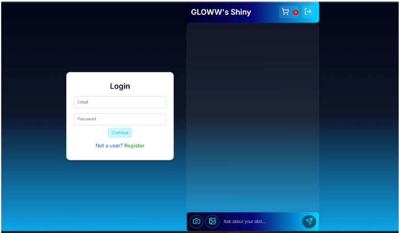
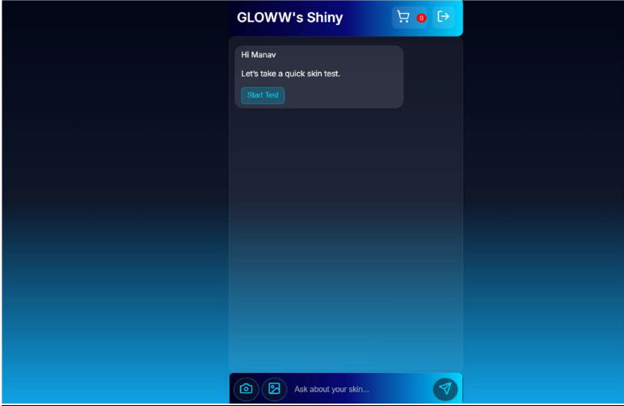
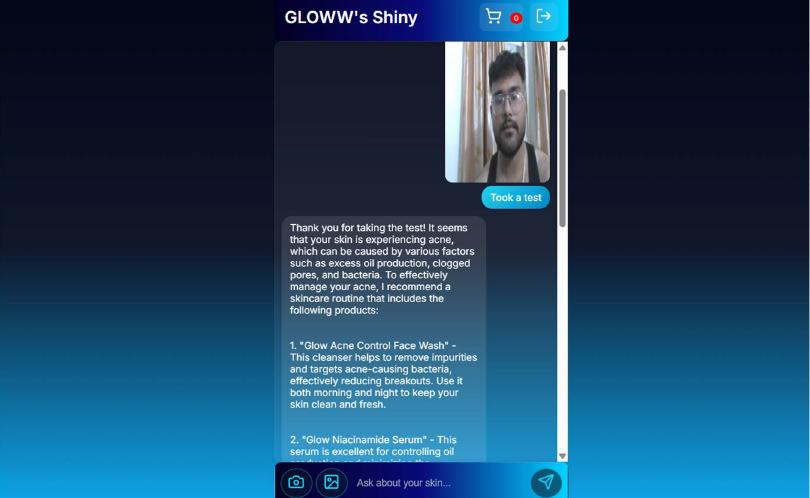
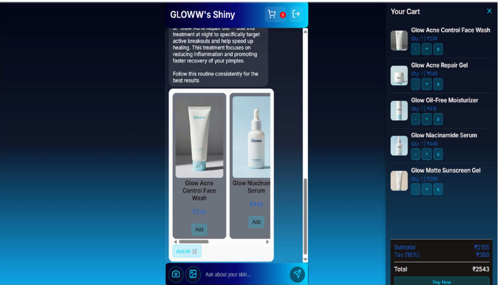

#  Shiny Skin AI

An end-to-end AI-powered skincare recommendation system that detects acne from facial images, recommends suitable skincare products, and provides intelligent skincare guidance through an AI chatbot.

---

##  Features

-  AI-based acne detection using a TensorFlow/Keras model
-  AI chatbot for skincare guidance
-  Secure JWT Authentication
-  User registration and login
-  Product recommendation system
-  Product management APIs
-  SQLite database with Alembic migrations
-  RESTful APIs built with FastAPI

---

##  Tech Stack

### Backend
- FastAPI
- Python
- SQLAlchemy
- Alembic
- SQLite
- JWT Authentication
- Passlib (Password Hashing)

### Machine Learning
- TensorFlow
- Keras
- CNN for Acne Detection

### Frontend
- HTML
- CSS
- JavaScript

### Tools
- Git
- GitHub

---

## 📂 Project Structure

```
Shiny-Skin-AI
│
├── Backend
│   ├── alembic
│   ├── db
│   ├── models.py
│   ├── main.py
│   ├── prediction.py
│   ├── chatbot_services.py
│   ├── auth.py
│   └── ...
│
├── Frontend
│
├── Assets
│
└── README.md
```

---

## Installation

### Clone the repository

```bash
git clone https://github.com/manav15jamwal/Shiny-Skin-AI.git
```

### Move into the project

```bash
cd Shiny-Skin-AI
```

### Create a virtual environment

```bash
python -m venv venv
```

### Activate it

Windows

```bash
venv\Scripts\activate
```

Linux / macOS

```bash
source venv/bin/activate
```

### Install dependencies

```bash
pip install -r requirements.txt
```

### Configure environment variables

Create a `.env` file inside the `Backend` folder and add your configuration values.

### Run the application

```bash
uvicorn main:app --reload
```

---

## Screenshots


- Home Page:
- 
- Login Page:
- 
- Acne Detection:
- 
- Product Recommendation:
- 

---

##  Security

- Passwords are securely hashed using Passlib.
- JWT Authentication is used for protected routes.
- API keys and secrets are stored in `.env` files (not committed to GitHub).

---

## Future Improvements

- Multiple skin condition detection
- Personalized skincare routines
- User dashboard
- Cloud deployment
- Email notifications
- Multi-language support

---

## Author

**Manav Jamwal**

- GitHub: https://github.com/manav15jamwal

---

##  License

This project is intended for educational and portfolio purposes.
